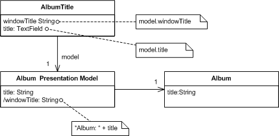

# General

## Model–View–ViewModel \(MVVM\)

## Reactive

* observes changes in application state
* propagates change notification throughout the application 
* renders views automatically in response to changes in state 

## Progressive

Can be incorporated into an existing webpage for simple tasks or entire apps.

